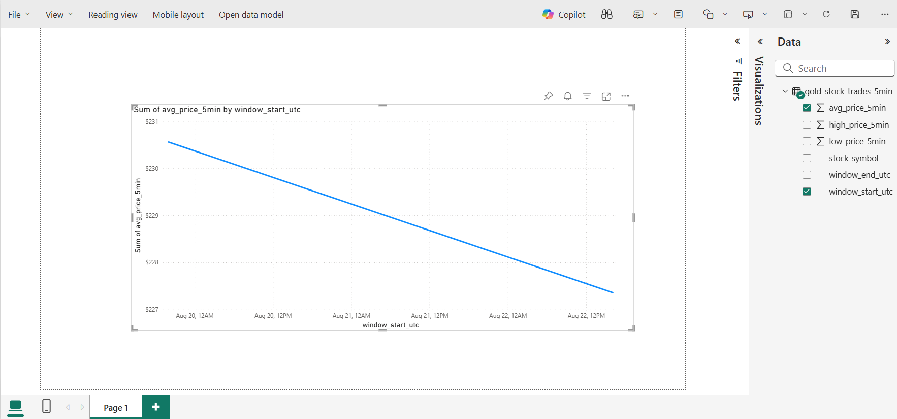

# Real-Time Stock Data Pipeline with Medallion Architecture

## Objective

This project demonstrates the implementation of a near-real-time data pipeline using the **Medallion architecture** within Microsoft Fabric. The objective was to ingest live stock quote data from a public API, process and refine it through Bronze, Silver, and Gold layers, and prepare it for business intelligence and analytics.

## Technologies Used

* **Platform:** Microsoft Fabric
* **Storage:** Fabric Lakehouse
* **Processing:** PySpark & Spark SQL in Fabric Notebooks
* **Data Format:** JSON, Delta Lake
* **BI Tool:** Power BI

## Project Pipeline: The Medallion Layers

The pipeline is structured into three distinct layers, each serving a specific purpose in the data refinement process.

### 🥉 Bronze Layer: Raw Data Ingestion

The goal of the Bronze layer is to ingest raw data and store it in its original, unaltered format. This creates a persistent, historical archive.

* **How it works:** A Python script in a Fabric Notebook calls the Finnhub API every 5 minutes to fetch the latest stock quotes. The raw JSON response is saved directly into the `Files` section of the Lakehouse, partitioned by symbol and date using Hive-style partitioning (e.g., `/bronze/trades/stock_symbol=AAPL/year=2025/...`).

### 🥈 Silver Layer: Cleaned & Structured Data

The Silver layer takes the raw data from Bronze and transforms it into a clean, structured, and queryable format.

* **How it works:** A PySpark job reads the raw JSON files from the Bronze layer, applies a schema, casts data to the correct types (e.g., converting Unix timestamps to a proper timestamp format), and extracts the stock symbol from the file path. The cleaned, structured data is then appended to a partitioned Silver Delta table named `silver_stock_trades`.

### 🥇 Gold Layer: Business-Ready Aggregates

The Gold layer creates highly refined, aggregated tables that are optimized for business users and analytics.

* **How it works:** A final Spark job reads the clean data from the Silver table and performs time-windowed aggregations. It calculates the 5-minute average, high, and low price for each stock symbol, creating a final, business-ready Gold table named `gold_stock_trades_5min`.

## Final Visualization

The final Gold table was connected to Power BI using **DirectLake mode** to create a simple line chart that visualizes the 5-minute average price trend.

*(Make sure the filename here matches the name of your uploaded screenshot!)*

## Key Learnings

* Hands-on implementation of the **Medallion architecture**, a modern best practice for structuring data lakehouse environments.
* Experience with near real-time data ingestion and processing using scheduled Fabric Notebooks.
* Proficiency in advanced **Spark transformations**, including parsing multi-line JSON, schema enforcement, and performing time-windowed aggregations.
* Practical application of data partitioning strategies (**Hive-style partitioning**) for optimizing query performance in a data lake.
